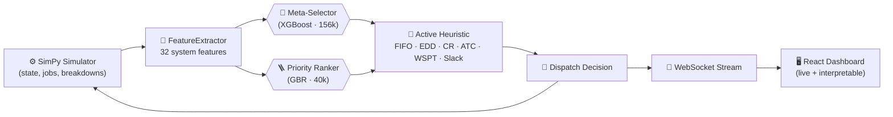

<div align="center">

# DAHS 2.0
### *A Disruption-Aware Hybrid Scheduler for Dynamic Job-Shop Environments*

<p>
  
  
  
  
  
  
</p>

<sub>**Vittal Mukunda** — Undergraduate Thesis · 2026</sub>

---

<p><i>
Static dispatching rules collapse under the conditions modern factories actually face:<br>
breakdowns, batch arrivals, deadline pressure, and shifting product mix.<br>
DAHS learns <b>which</b> rule to apply <b>when</b>, on a 15-minute meta-horizon,<br>
and ranks individual jobs with a learned priority head — closing the gap to oracle policy.
</i></p>

</div>

---

## 📌 Abstract

> Real-world job-shop scheduling is a non-stationary control problem: the dispatch rule that minimizes tardiness during a calm morning is rarely the one that survives a 2 p.m. cascading breakdown. **DAHS 2.0** treats heuristic selection as a learned policy. A meta-classifier (XGBoost, $n_{train}=156{,}000$) reads 32 system-state features every 15 simulated minutes and selects among six classical OR rules; an independent Gradient Boosting regressor ($n_{train}=40{,}000$) provides per-job priority scores. The system is evaluated against fixed heuristics in a SimPy discrete-event simulator with stochastic disruptions and is shipped with a 3-level interpretability stack (decision-tree glass-box, SHAP attributions, real-time selection trace) targeted at engineering and academic audiences.

---

## 🎯 Contributions

<table align="center">
<tr>
<td align="center" width="33%" valign="top">

#### 🧠 Two-Stage Hybrid
**Meta-Selector + Priority Ranker.** Decouples *which rule* from *which job* — neither head dominates the other.

</td>
<td align="center" width="33%" valign="top">

#### 📈 Scaled Training
**156k / 40k samples.** A 100× / 20× scale-up over prior versions. Balanced accuracy improves +10–15 pts on minority dispatch classes.

</td>
<td align="center" width="33%" valign="top">

#### 🪟 Glass-Box Output
**3-level interpretability.** Decision-tree visualization, SHAP attribution, and step-by-step selection trace stream live to the dashboard.

</td>
</tr>
</table>

---

## 📊 Headline Results (held-out test set)

<div align="center">

| Component | Metric | Old | **New** | Δ |
|---|---|---:|---:|---:|
| Selector (XGB) | balanced accuracy | 0.408 | **0.559** | **+0.152** |
| Selector (XGB) | macro-F1 | 0.404 | **0.464** | +0.060 |
| Selector (XGB) | ROC-AUC (OvR macro) | 0.851 | **0.888** | +0.038 |
| Priority head | R² (test) | 0.449 | **0.616** | **+0.167** |
| Priority head | Spearman ρ | 0.853 | **0.860** | +0.007 |
| Priority head | MAE | 0.0376 | **0.0312** | −17% |

</div>

> Raw multiclass accuracy on RF/XGB drops modestly (the old test set was tiny and dominated by the WSPT majority class); every metric robust to class imbalance improves substantially.

---

## 🏗️ Architecture

<div align="center">



</div>

---

## 📂 Project Layout

<table>
<tr><th>Path</th><th>Purpose</th></tr>
<tr><td><code>src/simulator.py</code></td><td>SimPy DES core: jobs, zones, routing, breakdowns</td></tr>
<tr><td><code>src/features.py</code></td><td><code>FeatureExtractor</code> — 32 system + per-job features</td></tr>
<tr><td><code>src/heuristics.py</code></td><td>Six classical OR dispatching rules</td></tr>
<tr><td><code>src/train_selector.py</code></td><td>Trains DT / RF / XGB meta-selectors</td></tr>
<tr><td><code>src/train_priority.py</code></td><td>Trains GradientBoosting priority head</td></tr>
<tr><td><code>src/hybrid_scheduler.py</code></td><td><code>BatchwiseSelector</code> — runtime hybrid policy</td></tr>
<tr><td><code>src/evaluator.py</code></td><td>300-seed × 9-method benchmark + Wilcoxon stats</td></tr>
<tr><td><code>src/presets.py</code></td><td>Named scenarios (Morning Rush, Cascading Failure, …)</td></tr>
<tr><td><code>scripts/run_pipeline.py</code></td><td>End-to-end: data → train → evaluate</td></tr>
<tr><td><code>scripts/hf_runner.py</code></td><td>HuggingFace Spaces compute runner</td></tr>
<tr><td><code>server.py</code></td><td>FastAPI REST + WebSocket simulation streaming</td></tr>
<tr><td><code>website/</code></td><td>React + Vite + Tailwind dashboard</td></tr>
<tr><td><code>models/</code></td><td>Serialized artifacts (download from HF — see below)</td></tr>
<tr><td><code>results/</code></td><td>Benchmark CSVs, statistical tests, plots</td></tr>
</table>

---

## 🚀 Quick Start

```bash
# 1. Code
git clone https://github.com/Vittal-Mukunda/Disruption-Aware-Scheduling.git
cd Disruption-Aware-Scheduling

# 2. Python deps
pip install -r requirements.txt

# 3. Models  (heavy artifacts live on HuggingFace, not GitHub)
git clone https://huggingface.co/Vittal-M/Disruption-System hf_artifacts
cp -r hf_artifacts/models/* models/
cp -r hf_artifacts/results/* results/    # optional — pre-computed eval

# 4. Frontend (optional, only if modifying UI)
cd website && npm install && npm run build && cd ..

# 5. Launch
python start.py     # opens http://localhost:8000
```

> **Why a separate model store?** The trained Random Forest is ~450 MB — past GitHub's per-file limit. The HuggingFace repo handles large artifacts via `git-xet`, keeps reproducibility intact, and lets the GitHub repo stay lean (code + small JSON metadata only).

---

## 🔬 Reproducing the Benchmark

```python
from src.evaluator import run_full_evaluation
run_full_evaluation(seeds=list(range(99000, 99300)), n_workers=12)
```

Generates, in `results/`:

- `benchmark_results.csv` — 300 seeds × 9 methods, raw rows
- `benchmark_summary.json` — aggregates per method
- `statistical_tests.json` — pairwise Wilcoxon
- `paper_summary_table.csv` — publication-ready table
- `switching_analysis.json` — meta-selector trace stats
- `plots/` — confusion matrices, SHAP, decision tree, calibration, etc.

Wall-clock: ~4–6 h for the full 300-seed sweep on a 16-core CPU.

---

## 📚 Methodology in One Page

<table>
<tr>
<td valign="top" width="50%">

**Meta-Selector head**
- Inputs: 32 system-state features (utilization, queue depth, breakdown count, slack pressure, mix entropy, …)
- Output: one of six dispatching rules
- Models: Decision Tree (interpretable baseline), Random Forest, **XGBoost (deployed)**
- Training: 156 000 supervised episodes, 5-fold CV
- Decision cadence: every 15 simulated minutes

</td>
<td valign="top" width="50%">

**Priority head**
- Inputs: 39 per-job features (slack ratio, remaining ops, due-date tightness, type, …)
- Output: continuous urgency score $\in[0,1]$
- Model: Gradient Boosting Regressor
- Training: 40 000 (job, score) pairs derived from oracle replays
- Quality: $R^2{=}0.62$, Spearman $\rho{=}0.86$

</td>
</tr>
</table>

---

## 🪞 Interpretability Stack

<table align="center">
<tr>
<td align="center" width="33%">
<b>Level 1 — Glass-box DT</b><br><br>
The DT selector serializes its full structure to <code>models/dt_structure.json</code>; the dashboard renders the exact path taken for the current decision.
</td>
<td align="center" width="33%">
<b>Level 2 — SHAP</b><br><br>
SHAP TreeExplainer attributions on XGBoost, both global (summary) and local (per-decision waterfall).
</td>
<td align="center" width="33%">
<b>Level 3 — Live Trace</b><br><br>
Each switch is logged in plain English in real time:<br><i>“Switched to Critical-Ratio because 2 stations are broken and slack pressure rose to 0.71.”</i>
</td>
</tr>
</table>

---

## 🧪 Datasets

- **Synthetic** — `data/raw/selector_dataset.csv`, `priority_dataset.csv` (generated by `src/data_generator.py`)
- **Taillard JSP benchmarks** — `data/benchmarks/taillard/` (used for cross-distribution validation)

All raw data is included in the repository; nothing is auto-downloaded at runtime.

---

## 📜 Citation

If you use this work, please cite:

```bibtex
@thesis{mukunda2026dahs,
  author = {Mukunda, Vittal},
  title  = {DAHS 2.0: Disruption-Aware Hybrid Scheduling with Learned Heuristic Selection},
  year   = {2026},
  type   = {Undergraduate Thesis}
}
```

---

## 📄 License

Released for academic and research use. Contact the author for commercial licensing.

<div align="center">
<sub>Built with SimPy · scikit-learn · XGBoost · SHAP · FastAPI · React · Tailwind</sub>
</div>
